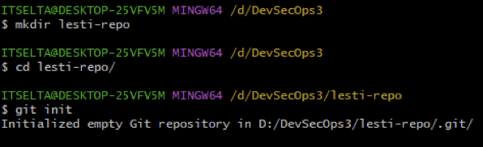

# Metrodata Academy SIBKM DevSecOps Task 3: Versioning

## Objective

- Establish a team.
- Simulate the implementation of the following Git commands (each member's individual implementation):
	- `git help`
	- `git init`
	- `git add <filename>`
	- `git status`
	- `git commit`
	- `git config`
	- `git log`
- Simulate the following events with each team member as the player/code contributor:
	- Fast-Forward Merging 
	- Three-Way Merging 
	- Resolving a Merge Conflict

## Solution

### 1. The Team

Our team consists of three members:
1. Lareza Farhan Wanaghi (Reza)
2. Indra Wicaksono (Indra)
3. Lesti Oktasari (Lesti)

We utilize "Google Meet" as our online communication platform to accomplish the task.

### 2. Individual Code Implementations
**1. Reza**
1. Before Reza began his implementation, he refreshed his memory by using Git's `help` subcommand:

	

2. Reza first created a folder and initialized a repository in that folder.

	
	
3. Reza then created a file in the repository, added it to the staging area, and checked the status before committing the change:

	

4. Reza then finally committed the change:

	
	
5. Reza then checked the history of his commits.

	

**2. Indra**
1. `git help`: Viewing Git documentation to see the available commands.

	

2. `git init`: Initializing a repository in a new folder to start a project with the repository name "indra-repo."

	

3. `git add .`: Adding files to the repository to include them in the staging area.

	

4. `git status`: Checking the status to verify if the desired files are in the staging area.

	

5. `git commit`: Committing the changes to record project progress in the history.

	

6. `git log`: Viewing all the commit history with `git log`.

	

7. `git remote`: Integrating the local Git repository with a GitHub repository.

	

8. `git push`: Pushing local source code to the GitHub repository.

	

**3. Lesti**
1. `git help`: Displaying the list of Git commands available.

	
	
2. Creating a folder and initializing a repository using `git init` to begin a project with the repository named "lesti-repo."

	

3. Using `git add` to stage files in the repository and checking the status with `git status` to ensure the desired files are in the staging area.

	

4. Committing the changes with `git commit` to record project progress in the commit history and using `git log` to view all commit history.

	

5. Integrating the local Git repository with a GitHub repository using `git remote`.

	

6. Switching branches to the main branch and merging it with her branch using Git commands.

	

### 3. Fast-Forward Merging Simulation

1. Reza first created a remote repository on GitHub and invited his team members to collaborate with the repository.

	
	
	

2. Reza then set up a repository and added the remote repository's address to the repository.

	

3. Reza created a branch called "reza."

	

4. Reza created a new file and pushed it to the repository.

	

5. Reza then switched to the main branch, merged it with his branch, and pushed the merge.

	

	

6. Indra cloned the repository on his machine.

	

7. Indra then created a branch.

	

8. Indra created a new file and pushed it to the repository.

	

	

9. Indra then merged his branch into the main branch.

	

10. Lesti cloned the repository on her machine, added a file, and pushed it.

	

	

11. She switched to the main branch and merged it with her branch.

	

### 4. Three-Way Merging Simulation

1. Each member pushed a file containing their favorite number using their own branch.

	

	

	

2. Now, each member wanted to fetch each other's branches.

	

	

	

3. At this point, Reza wanted to merge Indra's branch into his branch.

	

4. Similarly, Indra wanted to merge Lesti's branch into his branch.

	

5. Meanwhile, Lesti wanted to merge her branch into Reza's branch.

	

### 5. Conflict

1. Now, each member changed the `readme.md` file to include each member's name. Reza updated the file with the following content and pushed it:

	

2. At the same time, Indra also updated the same file and pushed it.

	

3. Meanwhile, Lesti also changed the `readme.md` file.

	

	

4. At this point, Lesti wanted to merge with Reza and encountered a conflict.

	

	

5. Similarly, Indra wanted to merge with Lesti and encountered a conflict.

	

	

6. At this point, Reza and Lesti updated their `readme.md` file again and pushed it.

	

	

7. Reza then wanted to merge with Lesti and encountered a conflict.

	
