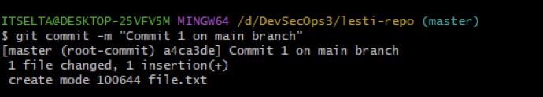

## Metrodata Academy SIBKM DevSecOps Task 3: Versioning

- Establish a team.
- Simulate the implementation of the following Git commands on each team member's machine (include screenshots):
	- `git help`
	- `git init`
	- `git add`
	- `git status`
	- `git commit`
	- `git config`
	- `git log`
- Simulate the following events with each team  member as the player/code contributor (include screenshots):
	- Fast-Forward Merging 
	- Three-Way Merging 
	- Resolving a Merge Conflict

## Solution

### 1. The Team

Our team consists of three members:
1. Lareza Farhan Wanaghi (Reza)
2. Indra Wicaksono (Indra)
3. Lesti Oktasari (Lesti)

We utilize "Google Meet" as our online communication platform to accomplish the task.

### 2. Individual Code Implementations
1. Each team member initiated the implementation process by executing the `git help` command in the following order: Reza, Indra, and Lesti.

	

	

	

2. Subsequently, they created a folder and initialized a Git repository within that folder using the `git init` command.

	

	
	
	

3. Next, they created a file within the repository, added it to the staging area using the `git add` command, and checked its status before committing the changes using the `git status` command.

	

	

	

	

4. By using the `git commit` command, they finally proceeded to commit the changes.

	

	

	
	
5. Following the commits, they reviewed the commit history using the `git log` command.

	

	

	

	

### 3. Fast-Forward Merging Simulation

1. Reza first created a remote repository on GitHub and invited his team members to collaborate with the repository.

	

	

2. Reza then set up a repository and added the remote repository's address to the repository.

	

3. Reza created a branch called "reza," put a new file into the branch, and then pushed the branch to the remote repository.

	

	

4. Reza then switched to the main branch, merged it with his branch, and pushed the merge.

	

	

5. Indra cloned the repository on his machine. He then created a branch called "indra", put a new file into the branch, and pushed the branch to the remote repository.

	

	

	

	

6. Indra then merged his branch into the main branch.

	

7. Lesti cloned the repository on her machine. She then added a new branch, put a file into it, and then pushed it.

	

	

8. She then switched to the main branch and merged it with her branch.

	

### 4. Three-Way Merging Simulation

1. Each member pushed a file containing their favorite number using their own branch.

	

	

	

2. Now, each member wanted to fetch each other's branches.

	

	

	

3. At this point, Reza wanted to merge Indra's branch into his branch.

	

4. Similarly, Indra wanted to merge Lesti's branch into his branch.

	

5. Meanwhile, Lesti wanted to merge her branch into Reza's branch.

	

### 5. Conflict

1. Now, each member changed the `readme.md` file to include each member's name. Reza updated the file with the following content and pushed it:

	

2. At the same time, Indra also updated the same file and pushed it.

	

3. Meanwhile, Lesti also changed the `readme.md` file.
	
	

	

4. At this point, Lesti wanted to merge with Reza and encountered a conflict.

	

	

5. Similarly, Indra wanted to merge with Lesti and encountered a conflict.

	

	

6. At this point, Reza and Lesti updated their `readme.md` file again and pushed it.

	

	

7. Reza then wanted to merge with Lesti and encountered a conflict.

	